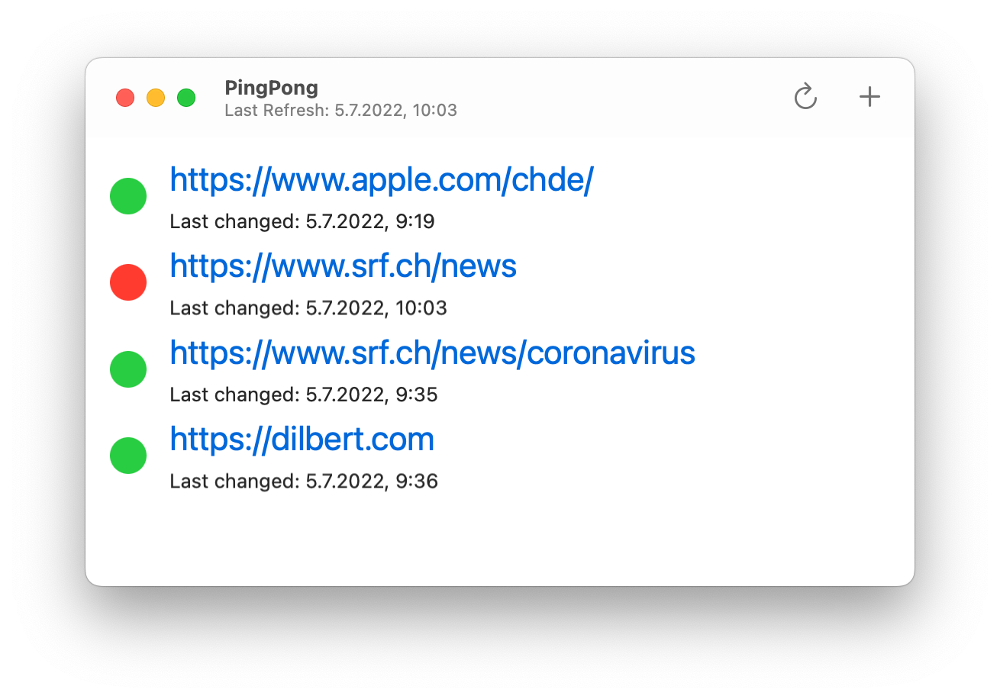

# Ping Pong

A small utility app for macOS using SwiftUI and Swift concurrency to regularly check URLs for changes.
Implemented along the [HWS+](https://www.hackingwithswift.com/plus/) live stream by Paul Hudson.

## Features

- Add and remove URLs to track for content changes.
- Visually highlight URLs that changed and keep time of last change.
- Allow user to manually start a refresh
- Use notifications and app icon bouncing to notify user of changes when in the background.
- Allow configuring refresh delays between 1 and 360 minutes
- Track only user visible content, i.e. stripping HTML meta data by converting it to attributed strings and then RTF 

## Screenshots

